<div align="center">


**A scoring sheet for HTTP.**
Drop in a `.har` export and read your network as a timeline — every phase, every byte, every wait.
Nothing is uploaded. There is no backend to upload it to.


</div>

<br>

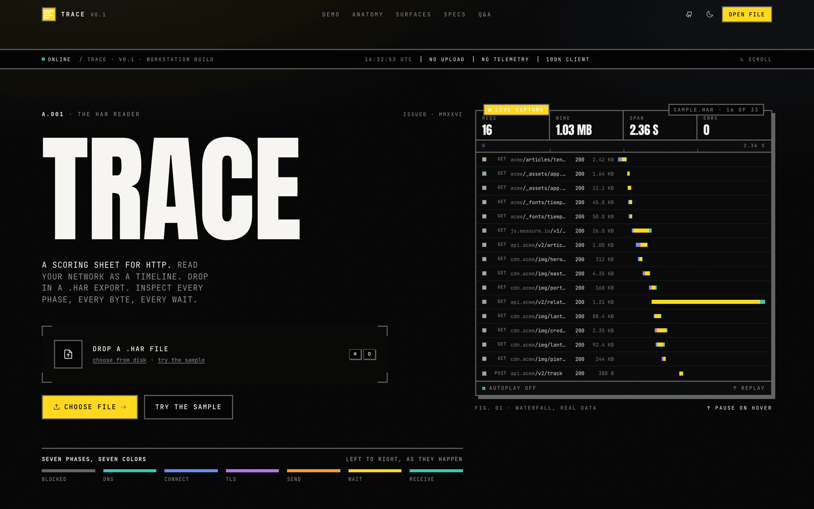

<div align="center">
<br>

**[Open the specimen sheet →](https://claude.ai/code/artifact/b20ce0bc-1e57-4e46-a497-728a27815e30)**

<sub>Five plates from the running app, a drag-to-compare before and after, and what the redesign fixed.<br>
Also in this repo as <a href="docs/showcase.html">docs/showcase.html</a>.</sub>

</div>

<br>

## The problem with every other HAR viewer

They paint the whole timing bar one color.

A HAR file records seven separate phases for every request — how long it queued, how long DNS took, how long the socket took to open, the TLS handshake, the upload, the wait for the first byte, and the download. Six of those are things you can fix. One of them is usually all of them.

If the bar is a single block, you cannot see which. So Trace gives each phase its own place on one ordered ramp: cool while the connection is being built, hot amber while you wait on a server, green when bytes finally arrive.

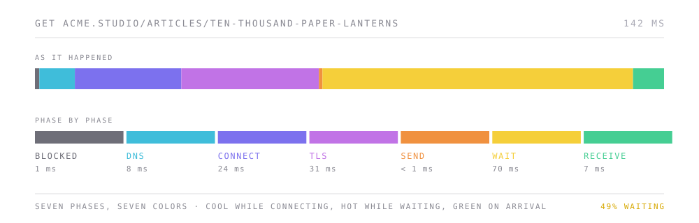

Once you know the ramp, you read a capture the way you read a score. A wall of amber means your backend is slow. A wall of violet means you are renegotiating TLS you should be reusing. A wall of green means you are shipping too many bytes.

<br>

## The waterfall

Every request in the capture, virtualized, with the phase spectrum running through it. The legend stays pinned to the bottom so the colors never need looking up.

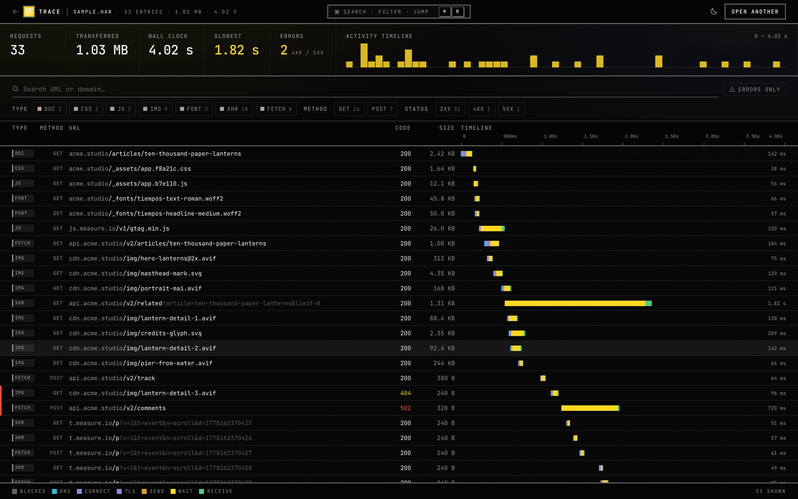

The strip along the top summarizes whatever survives your filters, so the numbers move as you narrow the set. **Slowest** is usually the one worth clicking. Drag across the activity histogram to clamp the whole view to a time window.

<br>

## The inspector

Click any row for seven lenses on a single request. Overview leads with where the time went, because that is nearly always the question.

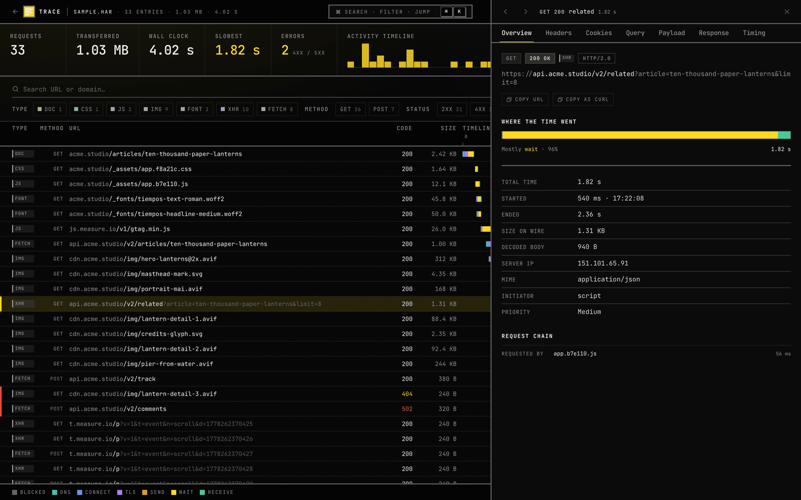

The **Timing** lens unpacks the bar and names the culprit outright.

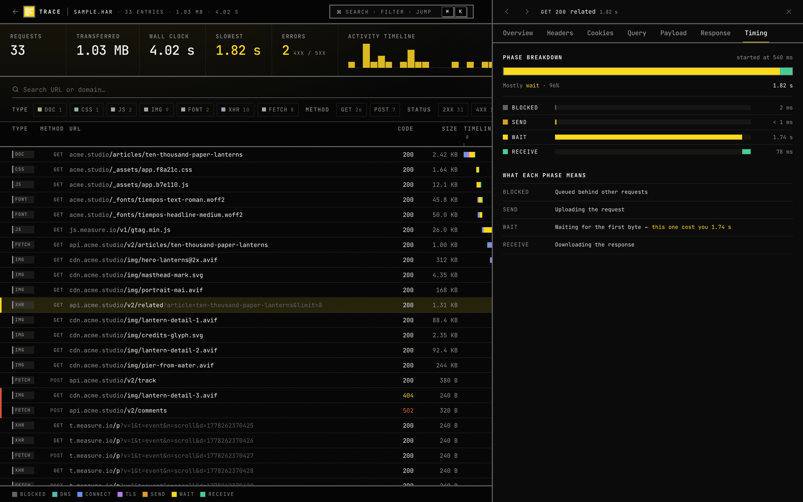

**Headers**, **Cookies**, **Query**, **Payload** and **Response** cover the rest. Response bodies are syntax-highlighted with Shiki, which loads only when you open a body that needs it.

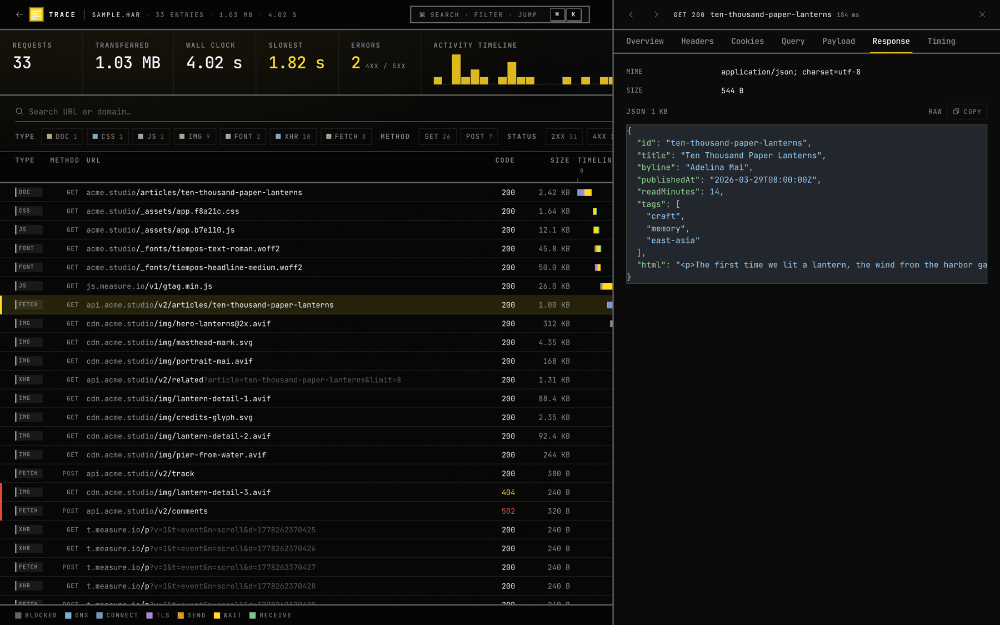

<br>

## Driving it

`⌘K` opens a command palette over everything — search, filter, jump, toggle the theme, load another capture.

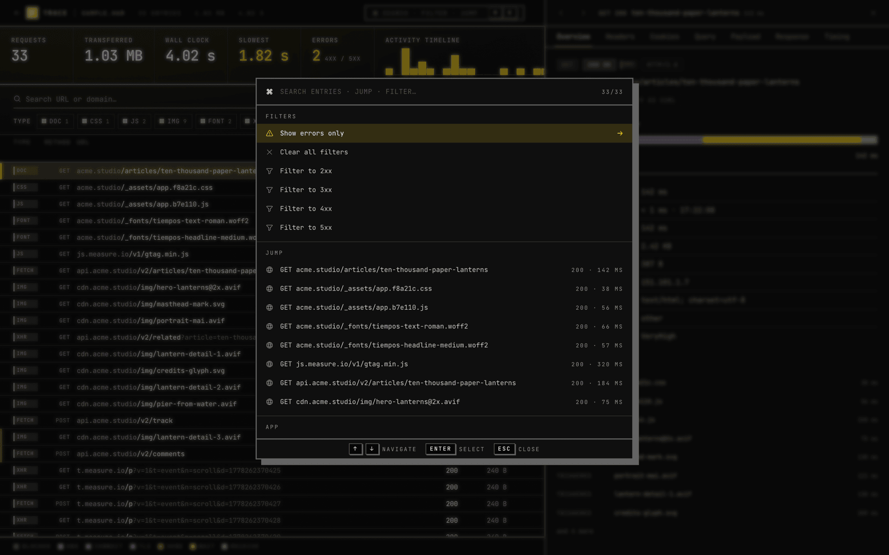

Or filter by hand. Type, method and status chips carry live counts, and anything active shows as a removable pill.

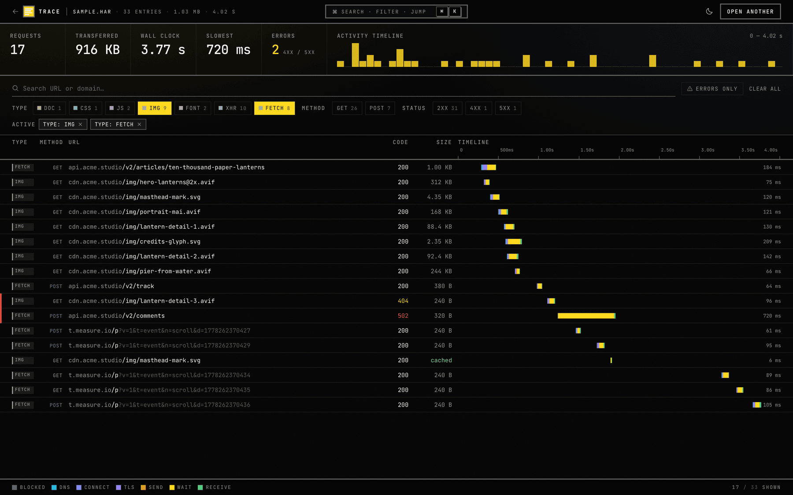

| Key | Action |
| --- | --- |
| `⌘O` | Open a `.har` file |
| `⌘K` | Command palette |
| `/` | Focus search |
| `↑` `↓` or `j` `k` | Move through the waterfall |
| `Enter` | Open the inspector |
| `←` `→` | Previous / next request, inside the inspector |
| `Esc` | Close the inspector, or the palette |

Drag a `.har` anywhere onto the page and it loads. That works on the landing page and inside the workspace.

<br>

## Light, dark, and small

The theme follows your system until you override it, and the override persists. Both themes get their own tuning of the phase ramp — the same seven hues, pitched darker on paper and lighter on ink.

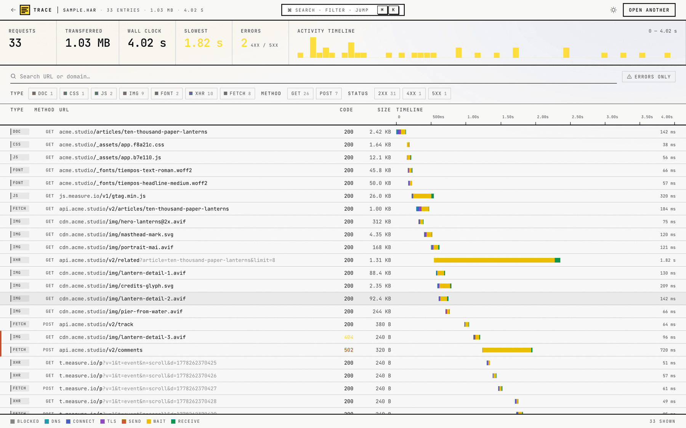

<br>

## Your capture stays on your machine

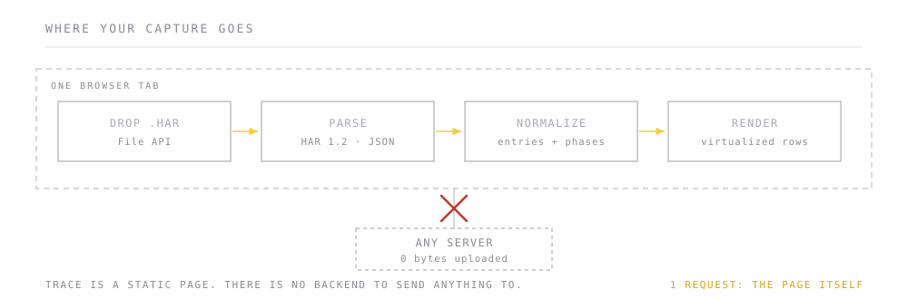

HAR files are not harmless. They contain every header of every request, which means session cookies, bearer tokens, API keys and whatever was in your request bodies. Pasting one into an online viewer hands all of that to someone else's server.

Trace is a static page. Parsing happens in your tab through the File API. Open your own DevTools Network panel while you use it and you will see exactly one request: the page itself.

<br>

## Running it

```bash
bun install
bun run dev        # http://localhost:5173
```

```bash
bun run build      # typecheck + production build to dist/
bun run preview    # serve the build
bun run typecheck  # types only
```

Bun is what the lockfile targets, but npm and pnpm work the same way. Node 20+.

There is no configuration and no environment variables. `bun run build` produces a `dist/` you can drop on any static host.

<br>

## What it is built from

| | |
| --- | --- |
| **Vite 6** + **React 18** + **TypeScript** | strict mode, no `any` in the data path |
| **Tailwind v4** via `@tailwindcss/vite` | one CSS file, no PostCSS config |
| **Motion** (`motion@12`) | page transitions and the stat counters |
| **@tanstack/react-virtual** | the waterfall, smooth past 5,000 entries |
| **Shiki** | response highlighting, lazy-loaded, six grammars |
| **@phosphor-icons/react** | used sparingly |
| **Anton** · **Familjen Grotesk** · **JetBrains Mono** | display · sans · everything technical |

<br>

## Layout

```
src/
├── App.tsx                    Landing ↔ Workspace
├── index.css                  Tailwind v4 theme, phase tokens, brutalist utilities
│
├── lib/
│   ├── har.ts                 HAR 1.2 types, parser, normalizer
│   ├── phases.ts              the phase spectrum — one source of truth
│   ├── classify.ts            entry → resource type
│   ├── stats.ts               summary, histogram buckets, domain breakdown
│   ├── format.ts              bytes / ms / status
│   └── shiki.ts               lazy highlighter, mime → language
│
├── hooks/
│   ├── useHar.tsx             file loading, filters, selection, time range
│   └── useTheme.tsx           light / dark, persisted
│
├── components/
│   ├── Workspace.tsx          the viewer
│   ├── InstrumentStrip.tsx    stats + drag-to-scrub histogram
│   ├── FilterToolbar.tsx      search, type / method / status chips
│   ├── Waterfall.tsx          virtualized rows, shared column grid
│   ├── WaterfallRow.tsx       one request
│   ├── TimingBar.tsx          the spectrum bar
│   ├── PhaseLegend.tsx        the key
│   ├── Inspector.tsx          the drawer
│   ├── inspector/             seven lenses + PhaseBreakdown
│   ├── CommandPalette.tsx     ⌘K
│   └── landing/               hero, anatomy, live demo, specs, FAQ
│
└── ui/                        Brutal.tsx, TypeChip, Logo, Tabs, Tooltip, …
```

`src/lib/phases.ts` is worth reading first. Phase order, labels, descriptions and colors all come from it — the waterfall, the inspector, the legend and the landing page's live demo all draw from the same seven values, so the ramp cannot drift out of sync between surfaces.

<br>

## Design notes

Soft-brutalist, with the rigor pointed at the data rather than the decoration.

- **Mono-first.** Body text is JetBrains Mono. Display headlines are Anton — condensed, poster-scale, uppercase.
- **No rounded corners, anywhere.** Radius tokens resolve to `0`. Borders are 2px. Shadows are hard offsets, never blurs.
- **Surveyor brackets** instead of dashed drop zones.
- **Amber, used surgically.** The primary CTA, focus rings, and the `wait` phase — the one a HAR most needs to tell you about. Nothing else gets it.
- **Type is read, not decoded.** Resource type shows as a three-letter chip with a quiet colored edge, so the saturated end of the palette belongs entirely to the phase ramp. Two loud color systems on one screen means neither is legible.
- **Structure that means something.** The landing page's hero footer is the phase key, not decoration, because the panel next to it is already drawing bars in those exact colors.

The product is the marketing: the landing page's live demo is a real, sandboxed Workspace running the bundled sample capture, not a screenshot.

<br>

## Regenerating the assets

The sample capture is synthetic and reproducible — a realistic page load with a slow API, a 404, a 502, a memory-cached asset and a pile of analytics beacons:

```bash
bun run sample     # → public/sample.har
```

Every image in this README is captured from the running app, so they cannot drift out of date:

```bash
bun run dev        # in one terminal
bun run screenshots
```

`scripts/screenshots.mjs` drives the app with Playwright, writes eleven PNGs to `docs/media/`, then downscales and quantizes them. It borrows the Chromium that `playwright-core` already has on disk; if there isn't one, run `bunx playwright install chromium` once, or point `CHROME` at any Chrome build. The downscale needs `sips` (macOS) and the quantize needs `pngquant` — both are optional, and it says so and carries on without them.

Two files in `docs/media/` are not regenerated: `workspace-before.png` is a deliberately frozen capture of the pre-revamp waterfall, kept for the comparison in the specimen sheet, and the three `.svg` diagrams are hand-authored.

<br>

## License

MIT — see [LICENSE](./LICENSE).

<div align="center">
<br>
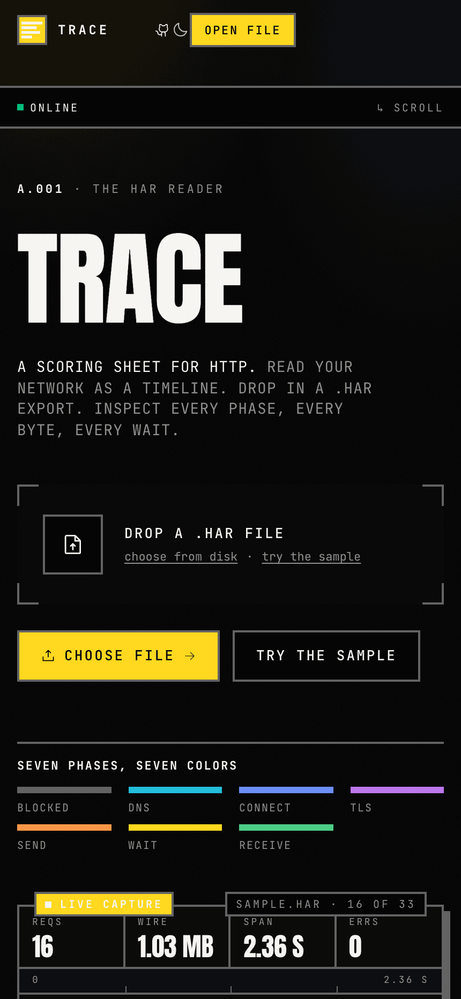
<br><br>
<sub>Trace · v0.1</sub>
</div>
